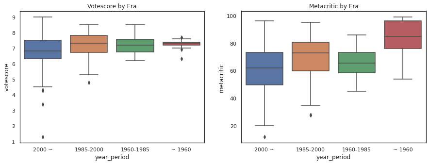
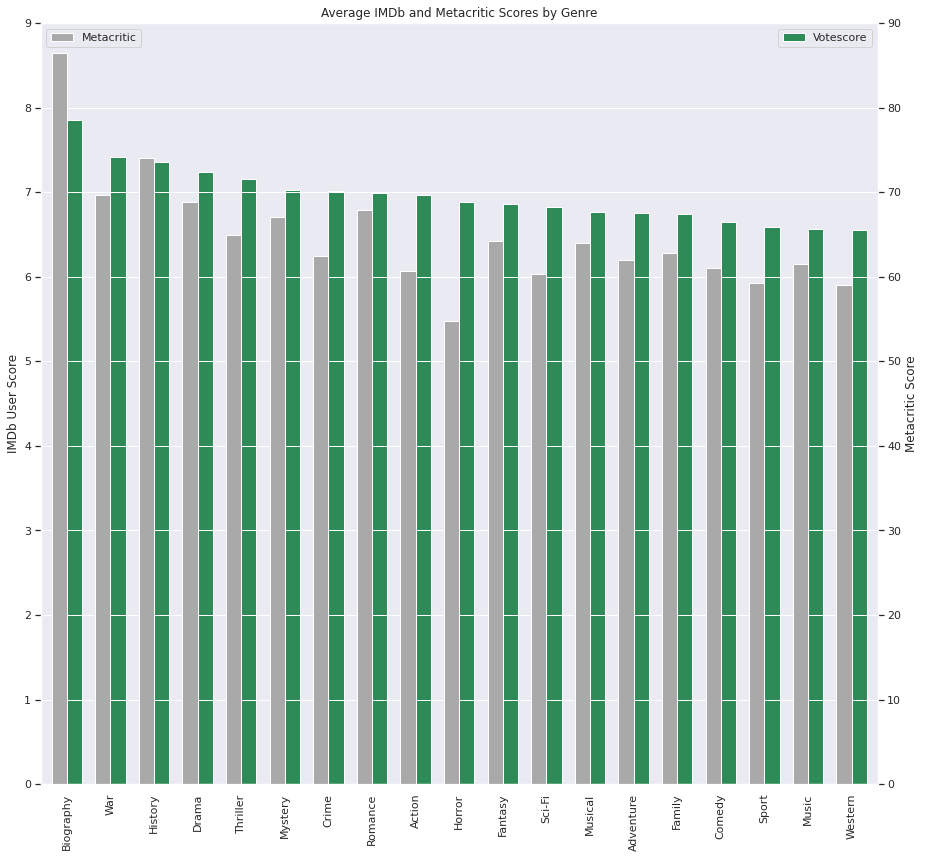
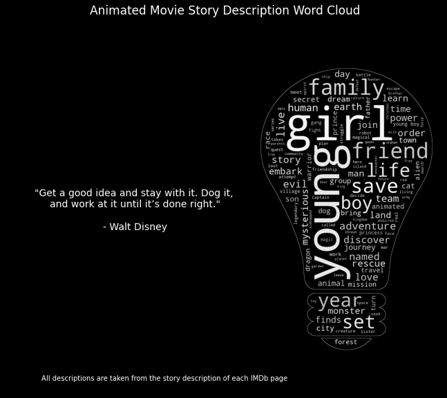

# Animation Fascination : Animated Movie Box Office / IMDb Votescore Estimator
---------------------
## Project Overview
This project was done with two objectives in mind:

* **Objective A**: Create a model that estimates a gross of an animated movie.

    MAE: ~$7,870,000
    RSME: ~$12,700,000

* **Objective B**: Create a model that estimates how liked an animated movie will be (target variable = IMDb votescore).

    MAE: ~0.145
    RSME: ~0.183

Other important tasks:

* Utilized selenium and parserhub to scrape the characteristics of over 450 animated movies on IMDb.

* Engineered new features using the genres, countries, and production companies involved to visualize their significance towards a movie's critical and commercial success.

* Performed exploratory data analysis to better understand the popularity of certain genre, rating and story tropes when making an animated movie.

* Tuned the parameters of multiple regression models with the use of GridSearchCV and RandomSearchCV to find the most optimized model.

* Set the most optimized model into production and through a client API with the use of Pickle and Flask.

---
## Resources used:

*Project Walkthrough Reference:* https://www.youtube.com/watch?v=MpF9HENQjDo&list=PL2zq7klxX5ASFejJj80ob9ZAnBHdz5O1t&index=1

*Web Scraper Guide:* https://www.analyticsvidhya.com/blog/2022/05/a-guide-to-web-scraping-rotten-tomatoes/

*K-Fold Target Encoding Guide:* https://www.kaggle.com/code/anuragbantu/target-encoding-beginner-s-guide

*CatBoost Regressor Guide:* https://towardsdatascience.com/catboost-regression-in-6-minutes-3487f3e5b329

*Productionizing a Model With Flask:* https://towardsdatascience.com/productionize-a-machine-learning-model-with-flask-and-heroku-8201260503d2

*Target Encoding Guide*: https://www.kaggle.com/code/anuragbantu/target-encoding-beginner-s-guide

---
## Web Scraping
Criteria for what movies to scrape:
* Movie must have "Animation" as one of its listed genre
* Movie must have at least 10,000 votes

Link used for this criteria: https://www.imdb.com/search/title/?title_type=feature&num_votes=10000,&genres=animation&sort=alpha,asc&view=advanced

Settings were tuned in ParseHub was used to scrape the following:

* Movie name
* MPAA rating
* Movie runtime
* IMDb user votescore
* Metacritc score
* Year released
* Number of user votes affecting votescore

To traverse through each movie's IMDb page, I used Selenium to scrap each movie's link into a singular list.

Selenium was also used to scrap specific components found only in each movie unique page. The following was taken:

* Budget estimate
* Opening weeked
* North American Gross
* Worldwide Gross
* Story description / Sypnosis
* Genres
* Production Countries
* Production Companies
* Aspect Ratio
* Writers
* Directors

---
## Data Collection / Cleaning
Upon creating a .csv file of my newly collected data, a lot of things still need to be done. This includes:

1. Replacing nulls with more appropiate values.

    a) Null ratings: "Not Rated"

    b) Metacritic and any columns regarding box office info: -1

    c) Aspect Ratio, Story Description, and Writers: "Unspecified"

2. Splitting the budget_est column into two features: The budget and the currency symbol used

3. Converting any foreign budget estimates to USD (for consistency)

    * For example, a budget estimated in yen (¥) is multipled by 0.0072 as 1 yen = $0.0072 today.

4. Converting all year and monetary values from string to an integer

5. A small amount of feature engineering

    a) Profit from worldwide gross minus budget estimate

    b) Averaging IMDb votescore with metacritic score if applicable

    c) Official language count. Production country count. Production company count

    d) Average budget per minute

    e) Director and Writer count

---
## Exploratory Data Analysis
At this point, the data is ready is be visualized using tools like matplotlib and seaborn. More feature engineering will also be done based on observed patterns.

---
## Data Modeling
For this project, I wanted to use two target variables: votescore and worldwide gross. For future reference, I will be referring the latter as model A while the former as model A.

For each model, the first thing I did was that I removed any features that were dependent on the target variable to minimize the chance of overfitting the model.

Next, I transformed some of my categorical variables into dummy variables. Particularly the variables with rather low cardinality.

Splitting the data into 70 train/30 test was next which was then followed by further encoding the rest of the categorical variables using target encoding [(guide can be found here)](https://www.kaggle.com/code/anuragbantu/target-encoding-beginner-s-guide)

Next, I decided to run a few different different models to see which one performs best.

For model A:

* K-Nearest
* Linear Regression (Baseline)
* Random Forest (GridSearchCV)
* Gradient Boost (GridSearchCV)
* Ensemble Methods: Stacking and Voting (KNN + RF + GB) (Voting Weights of 1, 5, 4 respectively)

For model B:

* Linear Regression (Baseline for Voting model)
* Lasso
* K-Nearest
* Gradient Boost (GS)
* XGBoost (GS)
* CatBoost (GS)
* Ensemble Methods: Stacking and Voting (LR + Lasso + GB + XGB + CB) (Voting Weights of 6,9,5,4,6 respectively)

These are the most recent results:

Model A:

| Model | MAE | RMSE |
| ----- | ----- | ----- |
| **Voting Ensemble** | **7.876632e+06** | **1.270393e+07** |
| Random Forest GS | 7.987815e+06 | 1.286332e+07 |
| Gradient Boost GS | 8.048294e+06 | 1.357587e+07 |
| Stack Ensemble | 1.025044e+07 | 1.892207e+07 |
| KNN | 1.159403e+07 | 1.774835e+07 |
| Linear Regression | 1.171606e+07 | 1.592840e+07 |

Model B:

| Model | MAE | RMSE |
| ----- | ----- | ----- |
| **Stack Ensemble** | **0.144748** | **0.183336** |
| Linear Regression | 0.155426 | 0.192965 |
| Voting Ensemble | 0.159145 | 0.207350 |
| Lasso | 0.176041 | 0.223385 |
| Gradient Boost GS | 0.184860 | 0.266962 |
| CatBoost GS | 0.217137 | 0.277372 |
| XGBoost GS | 0.219050 | 0.297711 |
| KNN | 0.441259 | 0.549787 |

---
## Putting the model into production

Using a flask API local endpoint, requests can be taken in the form of a list that specifies the movie's details in which the endpoint will respond with either an estimate of how liked a movie will be or how much money it will make worldwide. Code was modified from [this article by GreekDataGuy](https://towardsdatascience.com/productionize-a-machine-learning-model-with-flask-and-heroku-8201260503d2)
